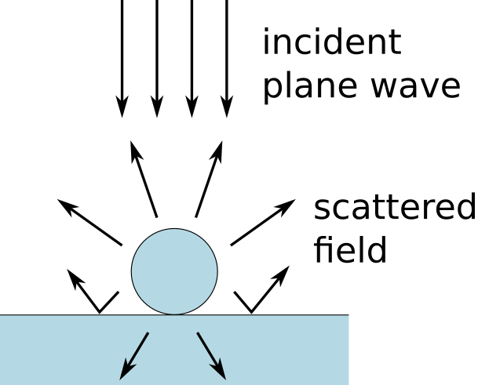

:orphan:

Setting up a simulation
=======================

This example is a minimal simulation, the "hello world" of Smuthi. 
It investigates scattering by a single glass sphere on a glass substrate and evaluates the total scattering cross section.

Click :download:`here <../../../../examples/tutorials/01_setting_up_a_simulation/dielectric_sphere_on_substrate.py>` 
to download the Python script.

The console output should look like in the above image.
   
