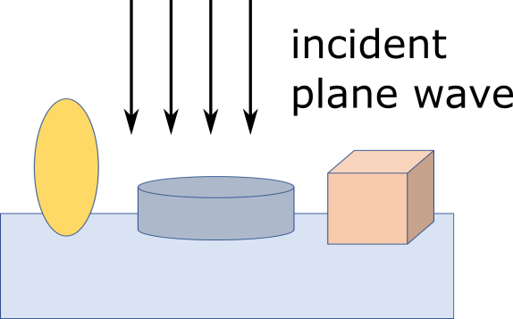

:orphan:

Non-spherical particles
=======================

This example demonstrates how to define non-spherical particles (a spheroid, a cylinder and a custom particle defined by an STL file). 

Click :download:`here <../../../../examples/tutorials/04_non_spherical_particles/non_spherical_particles.py>` 
to download the Python script and :download:`here <../../../../examples/tutorials/04_non_spherical_particles/cube.stl>` to download the STL file for the cube.
