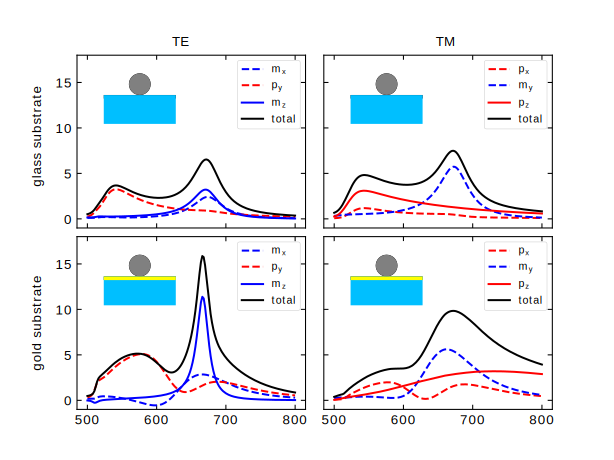

:orphan:

Extinction decomposition
=======================

Extinction is a fading of light because of scattering and absorption. Smuthi can process it and decompose to spherical components. The following example :download:`here <../../../../examples/tutorials/09_decomposited_extinction/decompose_extinction_for_one_sphere.py>`  reproduces the results from a paper by I.Sinev et al. "Polarization control over electric and magnetic dipole resonances of dielectric nanoparticles on metallic films" [1] and provides a example of conversion of multipoles from spherical in to cartesian coordinates.

[1] Laser Photonics Rev. 10, No. 5, 799–806 (2016), http://dx.doi.org/10.1002/lpor.201600055
