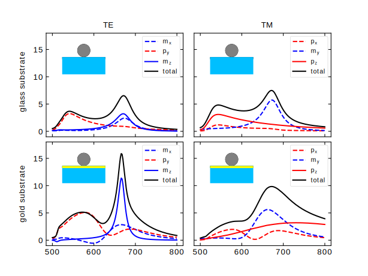

:orphan:

Multipole decomposition
=======================

Smuthi allows to analyze the contribution of individual multipole moments to the overall extinction cross section.
Click :download:`here <../../../../examples/tutorials/09_multipole_decomposition/decompose_extinction_for_one_sphere.py>` 
to download an example script which demonstrates this use case. It reproduces the results from 
I.Sinev et al. "Polarization control over electric and magnetic dipole resonances of dielectric nanoparticles on metallic films" [1].

[1] Laser Photonics Rev. 10, No. 5, 799–806 (2016), http://dx.doi.org/10.1002/lpor.201600055
