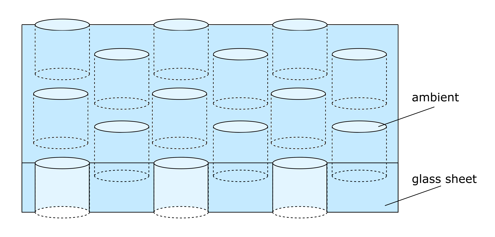

:orphan:

Plotting the near field of periodic structures
==============================================

| This example visualizes the transmittance of a plane wave through a 200nm thick glass sheet that is perforated by a periodic arrangement of nanoholes.
| Click :download:`here <../../../../examples/tutorials/10_periodic_near_field/perforated_glass_sheet.py>` to download the Python script.

   
| Dependend on the refractive index of the glass sheet's ambient (on top, below and within the nanoholes), the power flows primarily through the glass sheet or the nanholes respectively. The animation below shows the z-component of the Poynting vector, normalized by the power of the initial plane wave, directly behind the glass sheet for different refractive indices of the ambient medium between :math:`1\leq n_{\mathrm{amb}}\leq 2.5`. 
| Once the optical density of the ambient is larger than of the glass sheet (:math:`n_{\mathrm{amb}}>n_{\mathrm{glass}}=1.5`), the power flow is mainly confined within the nanoholes.  

.. image:: poynting_vector_z.gif
   :width: 45%

Some notes regarding run time
-----------------------------

| To this end, the evaluation of the coupling matrix of periodic particle arrangements is soley available based on a just-in-time (jit) compilation by Numba. For low particle counts per unit cell, the jit-compilation requires a significant amount of time compared to the actual simulation time and therefore is highly inefficient. 
| In the future this could be circumvented by an option to toggle the jit-compilation on and off. However, once more complex unit cells or a sweep of various unit cells is considered, the jit-compilation provides a significant speed up. 

The evaluation of the electric field can take a considerable time. With the following measures, you can reduce the run time of electric field evaluations:

- Use a graphics card. If you have an NVIDIA gpu available (doesn't need to be a fancy one), you can speedup calculations considerably. 
  See the installation diretions for :ref:`GPUAnchor`

   
