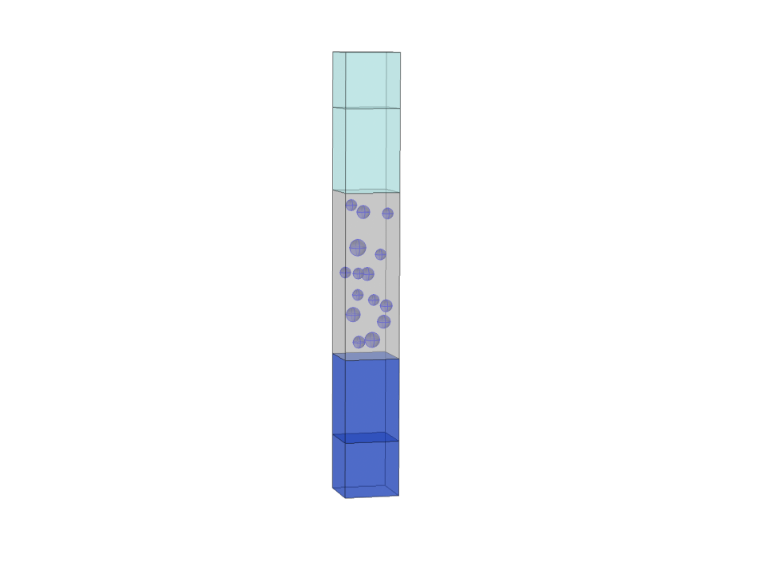

:orphan:

Fifteen periodic spheres in a slab 
==================================

In this benchmark, a periodic particle arrangement of dielectric spheres (n=2),
embedded in a thin film (n=1.3) between a glass substrate (n=1.5) and air, is
excited by a plane wave. The tetragonal Bravais lattice has a periodicity of 
:math:`P=|a_1|=|a_2|=1 \, \mathrm{\mu m}` and hosts fifteen spheres of various sizes
per unit cell.

The transmittance of a plane wave :math:`(\lambda=500 \, \mathrm{nm})` as a function of
the incident polar angle is computed with Smuthi and compared to results from a 
Comsol FEM simulation (see a snapshot of the Comsol model below).

   
   
The plot below compares the Smuthi results to the Comsol results in the far field of
the glass substrate.

   
The agreement between Smuthi (solid blue line) and Comsol (dashed orange line) is excellent. 
Only for highly oblique incidence the two solutions start to slightly deviate from each other.
Its explicit cause however remains open. We have reason to believe that numerical difficulties
arise for both techniques in case of highly oblique excitation.
On one side, the perfectly matched layers (PMLs) utilized in the finite
element simulations are known to reflect a considerable amount of light for oblique incidence. 
On the other side, the oblique incidence :math:`(|k_{\mathrm{in}\|}| \approx k)` renders the
evaluation of Ewald lattice sums (utilized in Smuthi) more challenging. 

