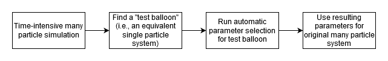

.. _AutoParamAnchor:

Automatic parameter selection
=============================

Smuthi offers a module to run an automated convergence test for the following parameters:

- Multipole truncation parameters `l_max` and `m_max` for each particle
- Sommerfeld integral contour parameters `neff_max` and `neff_resolution`.

Parameter selection procedure
-----------------------------

The user provides:

- a `simulation` object
- a detector function
- a realtive tolerance

The detector function
~~~~~~~~~~~~~~~~~~~~~

The **detector function** is a function defined by the user. It accepts a simulation object (one that has already been run) and returns a single quantity which we call the detector quantity. In other words, the detector function does some *post processing* to yield a value that we use to monitor convergence. If no function but the string "extinction cross section" is specified, the extinction cross section is used as the detector quantity. Other possible detector functions could map to the electric field at a certain point, or the scattered far field in a certain direction or whatever seems to the user to be a suitable measure for convergence of the simulation. 

The automatic parameter selection routine repeatedly runs the simulation and evaluates the detector quantity with subsequently modified numerical input parameters until the relative deviation of the detector quantity is less than the specified tolerance.

For flat particles near planar interfaces, the multipole truncation and the Sommerfeld integral truncation cannot be chosen independently, because we are dealing with a *relative convergence*, see :doc:`[Egel et al. 2016b] <literature>`. In that case, the user can set the `relative_convergence` flag to true (default). In that case, a convergence test for the multipole truncation parameters is triggered during each iteration of the `neff_max` selection routine:

.. list-table::

    * - .. figure:: images/flowchart_lmax.png

           Selection of `l_max`

      - .. figure:: images/flowchart_mmax.png

           Selection of `m_max`
					 
    * - .. figure:: images/flowchart_neffmax_relconv.png

           Selection of `neff_max`

      - .. figure:: images/flowchart_neffresol.png

           Selection of `neff_resolution`
					 

Some things to regard when using the automatic parameter selection:

- Both, the multiple scattering and the initial field contour are updated with the same parameters. A seperate optimization of the parameters for initial field and multiple scattering is currently not supported.
- The algorithm compares the detector value for subsequent simulation runs. The idea is that if the simulation results agree for different numerical input parameters, they have  probably converged with regard to that parameter. However, in certain cases this assumption can be false, i.e., the simulation results agree although they have not converged. The automatic parameter selection therefore *does not replace critical judging of the results by the user*.
- The simulation is repeated multiple times, such that the automatic parameter selection takes much more time than a single simulation.

For more details, see the API documentation on the :mod:`smuthi.utility.automatic_parameter_selection` module.

.. todo:: link to example

Simulations involving many particles
------------------------------------

A simulation with many particles can be busy for a considerable runtime. The above described automatic procedure might then be unpractical.
In this case, we recommend a strategy of "trial ballooning". The idea is to find a system that takes less time to simulate but that has similar
requirements with regard to numerical parameters.

Let us assume that we want to simulate light scattering by one thousand identical flat nano-cylinders located on a thin film system on a substrate.
Then, the selection of `neff_max` needs to be done with regard to the distance of the particles to the next planar interface, whereas `l_max` and 
`m_max` have to be chosen with regard to the particle geometry, material, and to the selected `neff_max`. 
Finally, `neff_resolution` needs to be chosen with regard to the layer system response.
All of these characteristics have nothing to do with the fact that we are interested in a many particles system. 
We can thus simulate scattering by a single cylinder on the thin film system and let the automatic parameter selection module determine suitable values
for `l_max`, `m_max`, `neff_max` and `neff_resolution`. These parameters are then used as input parameters for the 1000-particles simulation
which we run without another call to the automatic parameter selection module.

.. note:: One needs to be cautious when the many particles simulation involves large lateral distances. In that case, a finer resolution of the complex contour might be required compared to the single-particle test balloon. See the section on :ref:`SommerfeldResolutionAnchor` for details.

.. todo:: link to example

