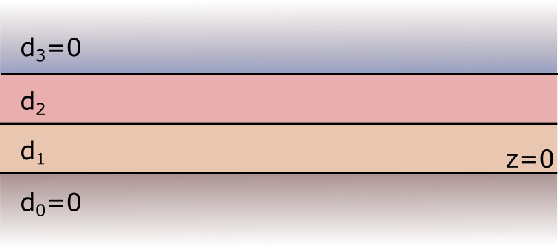
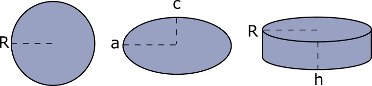

.. _ProgramStructureAnchor:

Building blocks of a Smuthi simulation
---------------------------------------

In general, a Smuthi simulation script contains the following building blocks:

- Definition of the optical system: the initial field, the layer system and a list of scattering particles are defined
- Definition of the simulation object: the simulation object is initialized with the ingredients of the optical system. Further numerical settings can be applied.
- Simulation start: The calculation is launched with the command `simulation.run()`
- Post processing: The results are processed into the desired output (in our example: scattering cross section).

The following chart illustrates the interaction between the various Smuthi modules:

.. image:: images/smuthi_overview.png
   :align: center

Initial field
~~~~~~~~~~~~~

Currently, the following classes can be used to define the initial field:

- **Plane waves** are specified by the vacuum wavelength, incident direction, polarization, complex amplitude and reference point. For details, see the API documentation: :class:`smuthi.initial_field.PlaneWave`.

- **Gaussian beams** are specified by the vacuum wavelength, incident direction, polarization, complex amplitude, beam waist and reference point. Note that for oblique incident directions, the Gaussian beam is in fact an elliptical beam, such that the electric field *in the xy-plane, i.e., parallel to the layer interfaces* has a circular Gaussian footprint. For details, see the API documentation: :class:`smuthi.initial_field.GaussianBeam`.

- **A single point dipole source** is specified by the vacuum wavelength, dipole moment vector and position. For details, see the API documentation: :class:`smuthi.initial_field.DipoleSource`.

- **Multiple point dipole sources** can be defined using the :class:`smuthi.initial_field.DipoleCollection` class. A dipole collection is specified by the vacuum wavelength and a list of dipole sources, which can be filled with the :meth:`smuthi.initial_field.DipoleCollection.append` method.

Layer system
~~~~~~~~~~~~

The layer system is specified by a list of layer thicknesses and a list of complex refractive indices.
Here is the link to the corresponding class in the API documentation: :class:`smuthi.layers.LayerSystem`.

Please note that

- the layer system is built from bottom to top, i.e., the first elements in the lists refer to the bottom layer.
- bottom and top layer are semi-infinite in size. You can specify a layer thickness of zero.
- the interface between the bottom layer and the next layer in the layer system defines the :math:`z=0` plane.
- the minimal layer system consists of *two* layers (e.g., a substrate and an ambient medium). Homogeneous media without layer interfaces cannot be defined, but they can be mimicked by a trivial system of two identical layers. However, we don't recommend to use Smuthi for such systems, because there are better software products to simulate systems in homogeneous media.

Particles
~~~~~~~~~

When defining a scattering particle, you need to provide the parameters regarding *geometry and material*, as well as the parameters :math:`l_\mathrm{max}` and :math:`m_\mathrm{max}` which define the *multipole expansion cutoff* (see section :ref:`MultipoleCutOffAnchor`).

The following classes can currently be used:

- **Spheres** are specified by their center position vector, complex refractive index, radius and multipole cutoff. For details, see the API documentation: :class:`smuthi.particles.Sphere`.

- **Spheroids** are specified by their center position vector, euler angles, complex refractive index, two half axis parameters, and multipole cutoff. See: :class:`smuthi.particles.Spheroid`.

- **Cylinders** are specified by their center position vector, euler angles, complex refractive index, radius, height and multipole cutoff. See: :class:`smuthi.particles.FiniteCylinder`.

- **Custom particles** allow to model particles with arbitrary geometry. They are specified by their position vector, euler angles, a FEM file containing the particle surface mesh, a scale parameter to set the physical size of the particle (if it deviates from the size specified by the mesh file) and multipole cutoff. See: :class:`smuthi.particles.CustomParticle`.

Some notes:

- The simulation of nonspherical particles depends on the NFM-DS Fortran code by Adrian Doicu, Thomas Wriedt and Yuri Eremin, see :doc:`[Doicu et al. 2006] <literature>`.
- Particles must not overlap with each other or with layer interfaces.
- The circumscribing spheres of non-spherical particles may overlap with layer interfaces (e.g. a flat particle on a substrate), but care has to be taken with regard to the selection of the numerical parameters. See :doc:`[Egel et al. 2016b] and [Egel et al. 2017] <literature>` for a discussion. Use of Smuthi's automatic parameter selection feature is recommended.
- The circumscribing spheres of non-spherical particles must not overlap with each other. There is a Smuthi package to allow for plane-wave mediated particle coupling developed by Dominik Theobald which allows to treat particles with overlaping circumscribing spheres, but this package is still in beta and requires expert knowledge to be used.

The simulation class
~~~~~~~~~~~~~~~~~~~~

The simulation object is the central manager of a Smuthi simulation. To define a simulation, you need to at least specify the optical system, i.e., an initial field, a layer system and a list of scattering particles.

In addition, you can provide a number of input parameters regarding numerical parameters or solver settings which you can view in the API documentation: :class:`smuthi.simulation.Simulation`. 

For your first simulations, you can probably just go with the default parameters. However, when approaching numerically challanging systems or if you are interested to optimize the runtime, we recommend to read the sections xyz to get an overview and to study the corresponding tutorial scripts.

.. todo:: Add links to sections and examples

Post processing
~~~~~~~~~~~~~~~

Once the :meth:`smuthi.simulation.Simulation.run` method has successfully terminated, we still need to process the results into the desired simulation output. Smuthi offers data structures to obtain near and far field distributions as well as scattering cross sections. Below, we give a short overview on a couple of convenience functions that can be used to quickly generate some output. 

- **Near fields** are electric field distributions as a function of position, :math:`\mathbf{E} = \mathbf{E}(\mathbf{r})`. The term *near field* is opposed to *far field* which is an intensity distribution in direction space. Near field does *not* imply that the field is evaluated very close to the particles. If you want to generate plots or animations of the electric field distribution, we recommend to use the :func:`smuthi.postprocessing.graphical_output.show_near_field` function. This is a very flexible and powerful function that allows a couple of settings which you can study in the API documentation.

.. note:: Spheres allow the evaluation of near fields everywhere (inside and outside the particles). Non-spherical particles allow the evaluation only outside the particles. Please also note that the computed near fields inside the circumscribing sphere of non-spherical particles are in general not correct.

- **Far fields** are intensity distributions in direction space (i.e., power per solid angle, measured far away from the scattering centers). We recommend to have a look at the functions :func:`smuthi.postprocessing.graphical_output.show_scattered_far_field`, :func:`smuthi.postprocessing.graphical_output.show_total_far_field` and :func:`smuthi.postprocessing.graphical_output.show_scattering_cross_section` and to study their input parameters in the API documentation.

.. math:: W = \int_0^{2\pi} \int_0^\pi  I(\alpha, \beta) \sin\beta  \mathrm{d}\beta \mathrm{d}\alpha

- **Cross sections**: If the initial field was a plane wave, the total scattering cross section as well as the extinction cross section can be evaluated. Please view the section :ref:`CrossSectionAnchor` for details.

If you need post processing that goes beyond the described functionality, we recommend to browse through the API documentation of the :mod:`smuthi.postprocessing` package or directly through the source code and construct your own post processing machinery from the provided data structure.

