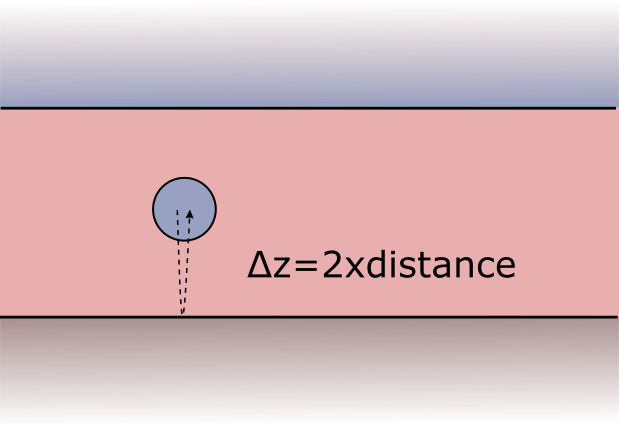

.. _SommerfeldParametersAnchor:

Complex integral contours
=========================

Sommerfeld integrals arise in the treatment of the layer system response to the scattered field or to the initial field (in case of dipole excitation). 
Their numerical evaluation relies on an integral contour that is deflected into the complex plane in order to avoid
sharp features stemming from waveguide mode singularities (see the section on :ref:`SommerfeldAnchor` for a short discussion).

.. image:: images/contour.png
   :scale: 70%
   :align: center

Default settings
-------------------
If you specify no input arguments with regard to the integral contours, default settings are applied.
Note, however, that this does not guarantee accurate results in all use cases.

Automatic contour definition
----------------------------
If you want to be on the safe side, use the automatic parameter selection feature to obtain a suitable integral contour. 
The drawback is a substantially enhanced runtime, as the simulation is repeated multiple times until the result converges.

.. todo:: link to section on auto selection

Manual contour definition
-------------------------
We recommend to use the `neff_imag`, `neff_max` and `neff_resolution` input parameter of the :class:`smuthi.simulation.Simulation` constructor.
Smuthi will construct contours based on this input and store them for the duration of the simulation as default contours for multiple scattering and
initial fields in the :mod:`smuthi.fields` module.

- `neff_imag` states how far into the negative imaginary the contour will be deflected in terms of the dimensionless effective refractive index, :math:`n_\mathrm{eff}=\frac{c\kappa}{\omega}` 
- `neff_max` is the point where the contour ends (on the real axis). Instead of `neff_max`, you can also provide `neff_max_offset` which specifies, how far `neff_max` should be chosen away from the largest relevant layer refractive index.
- `neff_resolution` denotes the distance :math:`\Delta n_\mathrm{eff}` between two adjacent sampling points (again in terms of effective refractive index).

The locations where the waypoints mark a deflection into the imaginary are chosen with consideration of the involved layer system refractive indices 
(see the section on :ref:`SommerfeldAnchor` for a discussion why that is necessary). 

This is how a call to the simulation contructor could look like::

   simulation = smuthi.simulation.Simulation( ...
                                             neff_imag=1e-2,
                                             neff_max=2.5,
                                             neff_resolution=5e-3,
                                             ... )

.. note:: If you need more control over the shape of the contour, read through the API documentation or contact the support mailing list (see :ref:`ContactAnchor`).

Multiple scattering and initial field contours
~~~~~~~~~~~~~~~~~~~~~~~~~~~~~~~~~~~~~~~~~~~~~~
In some use cases it makes sense to specify the contour for multiple scattering with different parameters than 
the contour for the initial field. For example, when a dipole is very close to an interface, but the particle centers are not.

In that case you can use the function :fun:`smuthi.fields.reasonable_Sommerfeld_kpar_contour` 
to construct an array of `k_parallel` values for each initial field and multiple scattering purposes, like this::

   # construct contour arrays
   init_kpar = smuthi.fields.reasonable_Sommerfeld_kpar_contour( ... )
   scat_kpar = smuthi.fields.reasonable_Sommerfeld_kpar_contour( ... )
	 
   # assign them to the respective objects
   simulation = smuthi.initial_field.DipoleSource( ...
                                                   k_parallel=scat_kpar,
                                                   ... )

   simulation = smuthi.simulation.Simulation( ...
                                             k_parallel=scat_kpar,
                                             ... )
   
Guidelines for parameter selection
----------------------------------

Contour truncation
~~~~~~~~~~~~~~~~~~

The contour truncation scale `neff_max` is a real number which specifies where the contour ends.
It should be larger than the refractive index of the layer in which the particle resides. The offset :math:`n_\mathrm{eff}-n`
should be chosen with regard to the distance between the particles (and point sources) to the next layer interface.
If that distance is large, the truncation scale is uncritical, whereas whereas point sources or particles whose
center is very close to a layer interface require a larger offset.
	
At a :math:`z`-distance of :math:`\Delta z`, evanescent waves with an effective refractive index of 
:math:`n_\mathrm{eff}` are damped by a factor of 

.. math:: \exp\left(2\pi\mathrm{i}\frac{\Delta z}{\lambda} \sqrt{n_\mathrm{eff}^2-n^2}\right),	

where :math:`\lambda` is the vacuum wavelength and :math:`n` is the refractive index of the medium.
	 

	 
	 
To select a reasonable `neff_max`, we should consider that the shortest possible interaction path is *twice* the :math:`z`-distance between some particle center (or dipole position) and the next layer interface.
	 
	
.. admonition:: Uncritical example

   A layer system consists of a substrate (:math:`n=1.5`), covered with a 1000nm thick layer of titania (:math:`n=2.1`) under air (:math:`n=1`).
   A silica sphere is immersed in the middle of the titania layer. The system is illuminated with a plane wave at vacuum wavelength of 550nm.
	 
   Then, :math:`\Delta z= 2\times 500\mathrm{nm}` such that evanescent waves with :math:`n_\mathrm{eff}=2.3` are already damped by a factor of
   :math:`\exp(-2\pi \frac{1000\mathrm{nm}}{550\mathrm{nm}} \sqrt{(2.3^2-2.1^2)}) \approx 2\times 10^{-5}` when they propagate to the layer interface and back to the sphere.
   Waves beyond that effective refractive index thus can be safely neglected in the particle-layer system interaction, such that a truncation parameter of :math:`n_\mathrm{eff, max}=2.3` is reasonable.

.. admonition:: Critical example

   A layer system consists of a substrate (:math:`n=1.5`), under air (:math:`n=1`).
   A point dipole source of wavelength 550nm is located 10nm above the substrate/air interface.
	 
   Here we need to consider :math:`\Delta z= 2\times 10\mathrm{nm}` such that Then, evanescent waves with 
   :math:`n_\mathrm{eff}=2.3` are only damped by a factor of
   :math:`\exp(-2\pi \frac{20nm}{550nm} \sqrt{(2.3^2-1^2)}) \approx 0.62` when scattered by the layer interface.
   Even a truncation of :math:`n_\mathrm{eff, max}=10` would only lead to an evanescent damping of
   :math:`\exp(-2\pi \frac{20nm}{550nm} \sqrt{(10^2-1^2)}) \approx 0.1` which might still not be enough.

Resolution
~~~~~~~~~~
.. todo:: write section

Deflection into imaginary
~~~~~~~~~~~~~~~~~~~~~~~~~
.. todo:: write section

