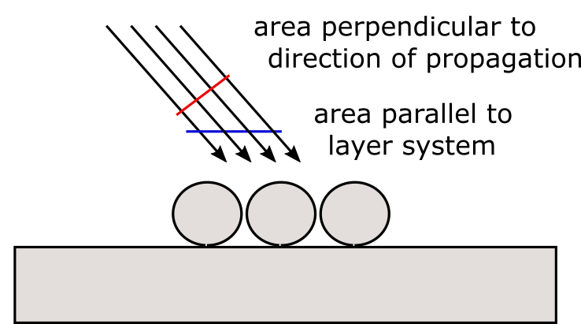
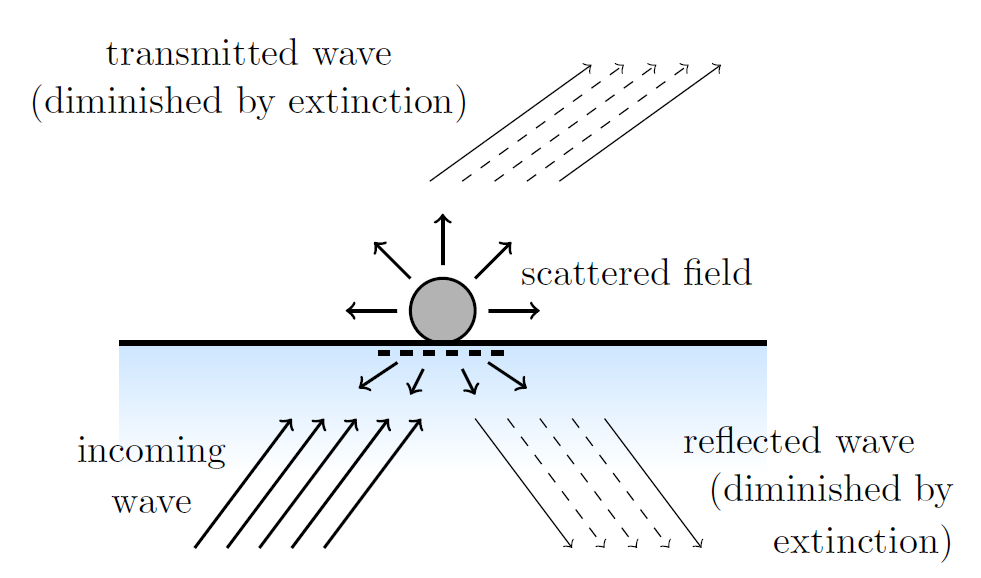

.. _CrossSectionAnchor:

Cross sections
--------------
If the initial excitation is given by a plane wave, it is natural to discuss the far field
properties of a scattering structure in terms of cross sections.

However, in the context of scattering particles near planar interfaces, the commonly used concepts of cross sections need further clarification.
In the following, we therefore discuss the meaning of cross sections as they are implemented in Smuthi.

Scattering cross section
~~~~~~~~~~~~~~~~~~~~~~~~
The concept of a scattering cross section is straightforward:
The incoming wave is specified by an intensity (power per area), whereas
the scattered field is characterized by a power, such that the scattered signal divided
by the initial signal yields an area. 

The total scattering cross section reads

.. math:: C_\mathrm{scat} = \frac{W_\mathrm{scat}}{I_\mathrm{inc}}

where :math:`W_\mathrm{scat}` is the total scattered power and :math:`I_\mathrm{inc}` is the incident irradiance (power per unit area perpendicular to the direction of propagation).

.. note:: In Smuthi versions < 1.0, a different definition of cross sections was used. In these versions, the incident irradiance was defined as "power per unit area parallel to the layer system", such that cross section figures computed with previous versions can deviate from the current version by a factor :math:`\cos(\beta_\mathrm{inc})`, where :math:`\beta_\mathrm{inc}` is the propagation angle of the incoming plane wave.

Extinction cross section
~~~~~~~~~~~~~~~~~~~~~~~~
The term "extinction" means that particles take away power from the incindent plane wave, such that they partially extinguish the incindent wave.
The power that they take away from the incoming wave is either absorbed or scattered into other channels, such that in the context of
scattering of a plane wave by particles in a homogeneous medium, the extinction cross section is usually defined as the
sum of the total scattering cross section and the absorption cross section.

However, this interpretation of extinction (i.e., the sum of particle absorption and scattering) is not applicable when besides the particle there 
is also a planarly layered medium involved. The reason is that besides particle absorption and scattering, also absorption in the layered medium has to be taken into account.

Instead, we apply what is usually referred to as the `optical theorem <https://en.wikipedia.org/wiki/Optical_theorem>`_ to define extinction (please see section 3.8.1 of :doc:`[Egel 2018] <literature>` for the mathematical details).
This way, we take the term "extinction" serious and provide a measure for "how much power is taken away by the particles from the incident plane wave?"

In fact, Smuthi computes two extinction cross sections: one for the reflected incoming wave and one for the transmitted incoming wave.
That means, the extinction cross section for reflection (transmission) refers to the destructive interference of the scattered signal with the
specular reflection (transmission) of the initial wave. It thereby includes absorption in the particles, scattering, and a modified absorption by the layer system, e.g. through incoupling into waveguide modes.

As a consequence, the extinction cross sections can be negative if (for example due to a modified absorption in the layer system) more light is reflected (or transmitted) in the specular direction than would be without the particles.

Conservation of energy is then expressed by the following statement: "For lossless particles near or inside a lossless planarly layered medium (that doesn't support any waveguide modes), the sum of top and bottom extinction cross section equals the total scattering cross section".