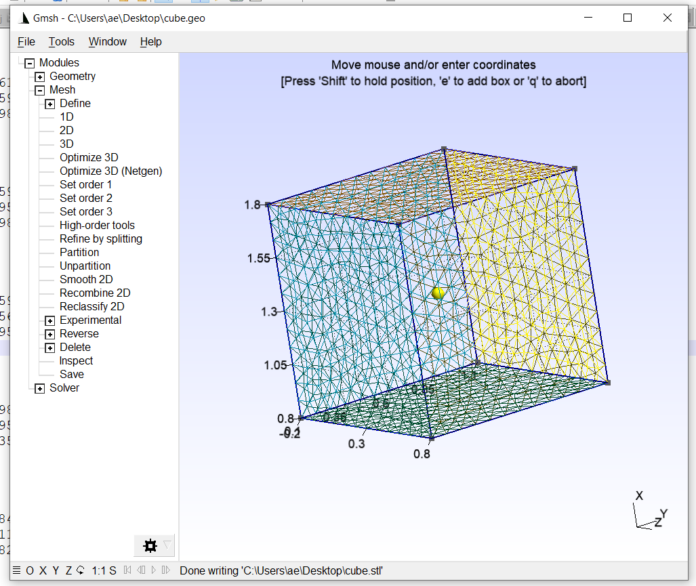

Custom particles
================

Since version 1.0.0, Smuthi allows to model scattering particles with a user-defined geometry by wrapping the NFM-DS TNONAXSYM functionality.

Creating a FEM file
-------------------

The particle surface must be specified in a FEM file.

- The first line is the number of surfaces.
- For each surface, the first line is the number of mesh elements
- Each mesh element is specified by a line containing: element location (x, y, z), element normal (x, y, z), element normal

Creating a FEM file using GMSH
------------------------------

One way to produce a FEM file is to use the `GMSH package <https://gmsh.info/>`_.
For example, to generate a cube, do:

- select "Geometry" → "Elementary entities" → "Add" → "Box"
- enter the parameters to achieve a 1 by 1 by 1 box at the center of the coordinate system
- select "Mesh" → 2D
- optionally: refine mesh by clicking "Mesh" → "Refine by splitting"
- Save the mesh in .stl format by "File" → "Export" and then pick "Mesh - STL Surface"
- In the STL options, select "Per surface". This is important, because a clear distinction between surfaces is required.

The so created .stl file can be converted to a FEM file using the :class:`sumuthi.linearsystem.tmatrix.nfmds.stlmanager` module through the :func:`convert_stl_to_fem` method.

Include custom particle in a Smuthi simulation
----------------------------------------------

To create a particle object with custom geometry, call the :class:`smuthi.particles.CustomParticle` class, for example::

  cube = smuthi.particles.CustomParticle(position=[0, 0, 100],
                                         refractive_index=1.52,
                                         scale=100,
                                         l_max=3,
                                         fem_filename="cube.fem")
