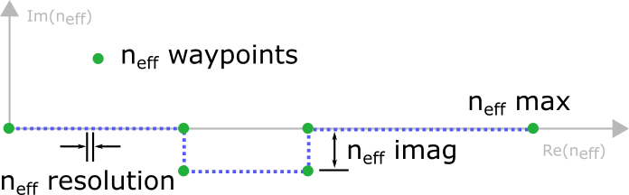

.. _NumericalParametersAnchor:

Numerical parameters
--------------------

We want to explain the meaning of the parameters that control Smuthi's performance regarding accuracy and runtime.

.. _MultipoleCutOffAnchor:

Multipole cut-off
~~~~~~~~~~~~~~~~~
The scattering properties of each particle are represented by its T-matrix :math:`T_{plm,p'l'm'}`
where :math:`plm` and :math:`p'l'm'` are the multipole polarization, degree and order of the scattered
and incoming field, respectively, see sections 3.3 and 2.3.2 of :doc:`[Egel 2018] <literature>`.
In practice, the T-matrix is truncated at some multipole degree :math:`l_{max} \ge 1` and order
:math:`0 \le m_{max} \le l_{max}` to obtain a finite system of linear equations.

In general we can say:

 - Large particles require higher multipole orders than small particles.

 - Particles very close to each other, very close to an interface or very close to a point dipole
   source require higher multipole orders than those that stand freely.

 - Larger multipole cutoff parameters imply better accuracy, but also a quickly growing numerical effort.

Literature offers various rules of thumb for the selection of the multipole truncation in the
case of spherical particles, see for example :doc:`[Neves 2012] <literature>` 
or :doc:`[Wiscombe 1980] <literature>`.

Otherwise, you can use Smuthi's built-in automatic parameter selection feature 
to estimate a suitable multipole truncation 

.. _SommerfeldParametersAnchor:

Sommerfeld integral contour
~~~~~~~~~~~~~~~~~~~~~~~~~~~

The layer system response to the scattered field is internally represented in terms of plane wave expansions, which give 
rise to the need of numerically evaluating so-called Sommerfeld integrals. As explained in the dedicated section (see :ref:`SommerfeldAnchor`)
the integral contour is deflected into the imaginary.

.. todo:: explain

Particle coupling lookup parameters
~~~~~~~~~~~~~~~~~~~~~~~~~~~~~~~~~~~

.. todo:: explain resolution and interpolation order

Near field calculation parameters
~~~~~~~~~~~~~~~~~~~~~~~~~~~~~~~~~

.. todo:: explain discretization and cut-off for the plane wave expansion for the near field calculation

Far field discretization
~~~~~~~~~~~~~~~~~~~~~~~~
 
.. todo:: explain discretization of the far field in direction space

General strategies to select numerical parameters
~~~~~~~~~~~~~~~~~~~~~~~~~~~~~~~~~~~~~~~~~~~~~~~~~

Empirical tests check the consistency of simulation results for a given numerical setting.
By "consistency" we mean for example the agreement to accurate benchmark results that can be
analytical results, results from other software or Smuthi results for a more accurate setting.

In certain cases, we can also check how accurately energy is conserved as a consistency criterion.
However, this criterion is suited only for certain numerical parameters.
In other cases, it is misleading.

.. note::
  In certain cases, even inaccurate simulations yield an accurately conserved energy. This will happen for
  example in case of a too small multipole truncation.

.. note::
   Smuthi currently supports only the evaluation of optical power in the far field 
   (and, in addition, the dissipated power of dipole sources).
   Therefore, it is only possible to check the conservation of energy in systems with no absorbing materials and no waveguiding.

Rules of thumb on the other hand can stem from heuristical reasoning or represent former experience.
They can be fit formulae to earlier results from empirical tests,
see for example :doc:`[Wiscombe 1980] <literature>` or :doc:`[Neves 2012] <literature>` for the selection of multipole truncation
or :doc:`[Egel2017] <literature>` for the truncation of Sommerfeld integrals.