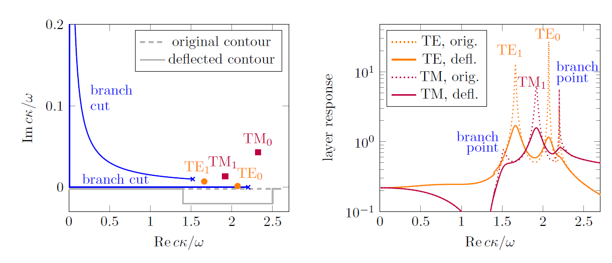

.. _SommerfeldAnchor:

Sommerfeld integrals
====================

This section contains background information about deflected integral contours in Smuthi.
It is not strictly necessary to read the below explanations.
The article is intended for those users who would like to get some understanding of the meaning of the 
numerical parameters describing the :ref:`SommerfeldAnchor`.

Singularities and contour deflection
------------------------------------

When computing the layer system mediated multiple scattering interaction between particles, Smuthi evaluates so-called Sommerfeld integrals.
These integrals run over the in-plane wave-vector of a plane wave expansion of the scattered field. When the in-plane wave-vector is expressed
in polar coordinates, the integral over the anglular coordinate can be done analytically (see chapter 3 of :doc:`[Egel 2018] <literature>`), 
such that the software is left with the numerical evaluation of 1D integrals over the radial component of the in-plane wave-vector (or shortly, the "in-plane wavenumber"):

.. math:: \int_0^\infty f(\kappa) \mathrm{d}\kappa 

with :math:`\kappa = \sqrt{k_x^2+k_y^2}`, and where :math:`f(\kappa)` includes terms representing the layer system response.

A straightforward approach to the numeric integration would be to evaluate the integrand along an equidistant grid :math:`\kappa_i=i\Delta\kappa` for :math:`i=0,\ldots,\kappa_\mathrm{max}/\Delta\kappa` and then apply e.g. the trapezoidal rule to compute the integral. 

However, in the vicinity of waveguide mode and branch point singularities the integrand :math:`f(\kappa)` is a rapidly varying function of :math:`\kappa` such that a very fine sampling of the integrand would be required in order to achieve a reasonable accuracy. This fact is illustrated in the below figure (taken from :doc:`[Egel 2018] <literature>`):

The left figure shows the complex :math:`\kappa`-plane, in which the integration path from :math:`\kappa=0` to :math:`\kappa=\infty` appears as a straight (dashed) line.
The location of waveguide mode singularities of the layer system response is marked with orange and red symbols. The less absorbing a slab waveguide is, the nearer are
the singularities to the real axis, and in the case of lossless materials, the singularities are right on the real :math:`\kappa`-axis.

The right plot (dotted red and orange lines) illustrates the effect that the vicinity of the waveguide mode singularities has on the integrand of the Sommerfeld integrals: the integrand function
shows distinct peaks (note the logarithmic scale) which complicate the numerical evaluation of the integrals. Note that, even if the layered medium 
does not support waveguide modes (e.g., a single interface between ambient and substrate half spaces), branch point singularities can lead to issues.

A simple strategy to avoid the vicinity of the singularities is to integrate along a complex contour which is deflected away from the real axis into the lower complex half plane. As the waveguide mode singularities as well as the branch cuts associated with square roots are located in the upper complex half plane, the integrand is an analytical function in the lower half plane. By virtue of Cauchy's theorem, the integral along the deflected contour thus yields the same result as along the real axis, but it is better suited for numerical evaluation.

The left part of the above figure shows such a deflected contour as a gray solid line (a rectangular deflection into the negative imaginary avoids the region that is close to the singularities. In the right part of the above figure, you can see the effect that the deflection has on the integrand (solid red and orange lines). As you can see, the integrand is 
much smoother and less problematic for numerical integration.

Effective refractive index
--------------------------
Smuthi features Sommerfeld contours with a rectangular deflection as depticted in the above figure. Instead of :math:`\kappa` (which has the dimension of an inverse length),
the contour is sometimes parameterized with respect to the dimensionless *effective refractive index* 

.. math:: n_\mathrm{eff} = \frac{c \kappa}{\omega},

where :math:`c` is the vacuum speed of light and :math:`\omega` is the angular frequency. The advantage is that, in terms of :math:`n_\mathrm{eff}`, the location of 
the singularities can be easily estimated:

- branch point singularities can exist at :math:`n_\mathrm{eff}=n_i`, where :math:`n_i` are the refractive indices of the layered medium
- waveguide mode singularities can exist at :math:`n_\mathrm{cladding, max} \leq n_\mathrm{eff} \leq n_\mathrm{core, max}`, where :math:`n_\mathrm{cladding, max}` is the 
  highest of the refractive indices of the outer layers and :math:`n_\mathrm{core, max}` is the highest of the refractive indices of the inner layers
  (in fact, TM modes can also exist at :math:`n_\mathrm{eff} \gt n_\mathrm{core, max}`, but in that case they are usually so strongly damped, that they do no harm to the numerical integration).
	
For example: A layer system consisting of a (semi-infinite) substrate with :math:`n=1.52`, covered with a thin film of some high-index material with :math:`n=2.1` which is finally topped with a (semi-infinite) air layer can yield branchpoint singularities at :math:`n_\mathrm{eff}=1`, :math:`n_\mathrm{eff}=1.52` and :math:`n_\mathrm{eff}=2.1` as well as waveguide mode singularities between :math:`n_\mathrm{eff}=1.52` and :math:`n_\mathrm{eff}=2.1`.
  

